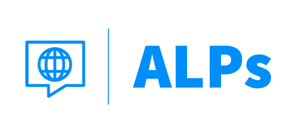
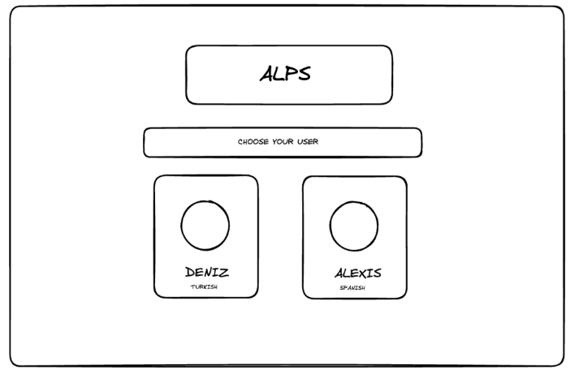
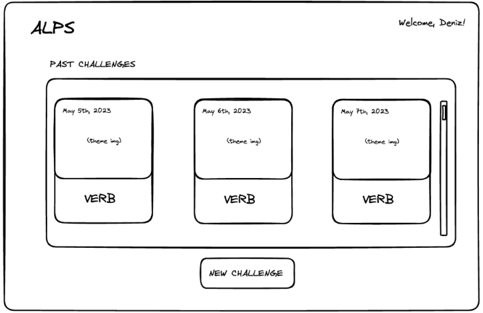
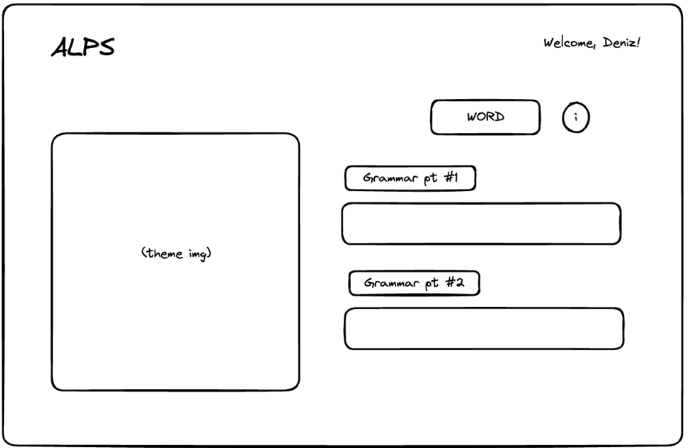
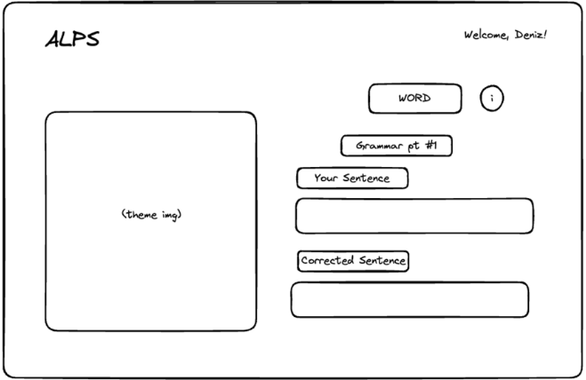
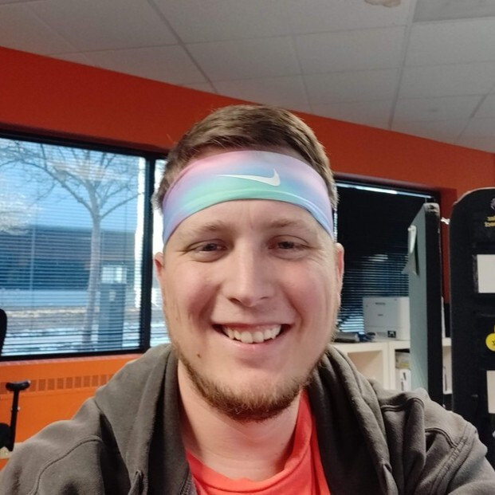
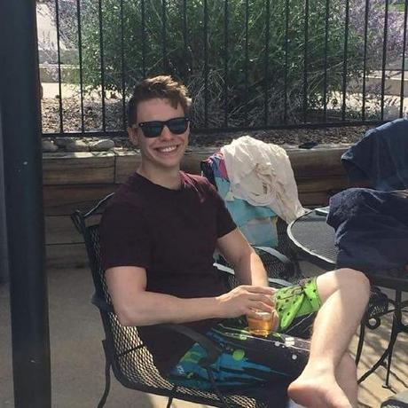
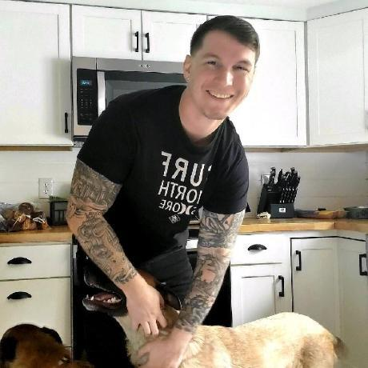

<!-- ReadMe -->

<!-- Opening -->
 

  
 
<!-- <h2 align="center"></h2> -->
  <h2 align="center">Advanced Language Practices (ALPs)</h2>
    

      Improve your language skills with inspiring images & immediate feedback!
      
 
      Now that you've "climbed the mountain" of learning another language, keep your skills fresh with regular practice! Language output (speaking & writing) is key but can get dull with routine drills, plus you may never know if it's entirely correct.  🔸  With ALPs, every writing challenge comes with an inspiring image to ignite your imagination, a random verb & grammar points to help focus your language, and immediate feedback with the help of AI!
    
 
      <a href="https://a-l-p-s.github.io/alps-ui/">Visit the ALPs website!</a>

 

  

  

<!-- TABLE OF CONTENTS -->
### Table of Contents

  <ol>
    <li>
      <a href="#about-the-project">About The Project</a>
    </li>
    <li>
      <a href="#getting-started">Getting Started</a>
    </li>
    <li><a href="#wireframes">WireFrames</a></li>
    <li><a href="#refactor">Future Iterations</a></li>
    <li><a href="#contact">Contributors</a></li>
  </ol>
 

<!-- ABOUT THE PROJECT -->
<h2 id="about-the-project">About the Project</h2>

🔸 [Deployed Site](https://a-l-p-s.github.io/alps-ui/)
 
🔸 [Backend Service](https://git.heroku.com/calm-thicket-75558.git)
 
🔸 [Back End Repository](https://github.com/A-L-P-s/ALPS_api)

 

**ALPs** was created by a cross-functional development team of students from the Turing School of Software and Design as their [capstone project](https://mod4.turing.edu/projects/capstone/).

The mission of **ALPs** is to provide users with writing promts that ignite their imagination and provide immediate feedback on their language output.

Users simply choose their target language via an avatar to start a new challenge. When they begin, they'll see a random verb, inspiring image, and multiple grammar points to create fresh, unique sentences. Once they submit the challenge -- with the help of AI -- immediate feedback and correct sentences are provided so they can review and learn even faster! Users also have the option to email a copy of their work to themselves since tracking personal progress not only expediates growth but also cultivates confidence!

 

<!-- Agile Methodology -->
### Agile Methodology

This method is a flexible and iterative approach to project management that focuses on collaboration, adaptability, and continuous improvement. 

#### ALPs Agile Workflow:
- Planning and outling an MVP.
- Continuous integration and continuous deployment using GitHub actions (CI) and GitHub pages (CD).
- Daily Standups with FE and BE teams.
- Weekly retros to reflect & improve

 

<!-- Built With -->
### Built With
#### `Collaboration Tools`

#### `Frontend Technologies`

#### `Packages Used`
- [React Spinners](https://www.npmjs.com/package/react-spinners)
  - NPM package used for loading animation viewed while challenge submission is being processed
- [React Modal](https://www.npmjs.com/package/react-modal)
  - NPM package used for instructions pop up on prompt page
- [@types/react-modal](https://www.npmjs.com/package/@types/react-modal)
  - NPM package used for type definitions for implementing the react modal in TypeScript

(<a href="#readme-top">back to top</a>)

<!-- GETTING STARTED -->
## Getting Started 

If you'd like to demo this application on your local machine:
1. Fork and clone this repo: `git clone git@github.com:A-L-P-s/alps_ui.git`
2. Visit the [Backend Repo](https://github.com/A-L-P-s/ALPs_api) and follow the steps to demo the ALPs API locally
3. Navigate to the root folder: `cd alps_ui`
4. Run: `npm install` to install necessary dependencies
5. Run: `npm start` to open the local host on your machine

 

<!-- Testing -->
### Testing 

To run the test specs in Cypress, run `npm run cypress` in your terminal within your Apls UI repo!

## WireFrames 
  

  
HomePage

  

  
User Dashboard

  

  
New Challenge Page

  

  
 

  
Individual Challenge Page

  

(<a href="#readme-top">back to top</a>)

<!-- Future Iterations -->
<h2 id="refactor">Future Iterations</h2> 

  
See Refactoring Suggestions

  <dl>
    <dt>🔸 Delete Past Challenge</dt>
      <dd>- Allow users to delete challenges that they do not want to see on their dashboard! This would require adding a button on the past challenge feedback component that would hit the existing BE delete endpoint.</dd>
    <dt>🔸Login Page</dt>
      <dd>- Add input fields to authenticate user and save their data.</dd>
    <dt>🔸More Languages</dt>
      <dd>- We currently have data and functionality for practicing Spanish, Turkish, and Vietnamese. In the future, we would love to update our application to support more languages!</dd>
    <dt>🔸More Practice</dt>
      <dd>- Currently, a singular challenge prompts the completion of 2 sentences. In the future, we would love to add more sentences/different activities to exercise language knowledge!</dd>
  </dl>

(<a href="#readme-top">back to top</a>)

<h2 id="contact">Contributors</h2>

 

|  |  |  |  |  | 
| ------------------ | ------------ | -------------- | ----------- | -------------- | 
| Kirk Hauck | Bea Ordonez | Katherine Blaine | Tyalor Pridgen | Brian Zanti | 
| Frontend Developer | Frontend Developer| Frontend Developer | Project Mentor | Project Manager |
| [GitHub](https://github.com/kirkhauck) | [GitHub](https://github.com/bea-ordonez) | [GitHub](https://github.com/KatherineBlaine) | [GitHub](https://github.com/pridgey) | [GitHub](https://github.com/BrianZanti) |
| [LinkedIn](https://www.linkedin.com/in/kirk-hauck/) |  [LinkedIn](https://www.linkedin.com/in/bea-ordonez/) | [LinkedIn](https://www.linkedin.com/in/katherinekblaine/) | [LinkedIn](https://www.linkedin.com/in/taylor-pridgen-a3aa7918/) | [LinkedIn](https://www.linkedin.com/in/brianzanti/) |

 

|  |  |  |  |  |
| ------------------ | ------------ | -------------- | ----------- | -------------- | 
| Caleb Thomas | James Taylor | Huy Phan | David Marino | Melony Erin Franchini |
| Backend Developer | Backend Developer | Backend Developer | Backend Developer | Backend Developer | 
| [GitHub](https://github.com/cjthomas00) | [GitHub](https://github.com/JTaylor28) | [GitHub](https://github.com/HuyPhan2025) | [GitHub](https://github.com/davejm8) | [GitHub](https://github.com/MelTravelz) |
| [LinkedIn](https://www.linkedin.com/in/calebjthomas/) |  [LinkedIn](https://www.linkedin.com/in/james-taylor-a02a7a199/) | [LinkedIn](https://www.linkedin.com/in/huy-phan-2471b3261/) | [LinkedIn](https://www.linkedin.com/in/davidjmarino8/) | [LinkedIn](https://www.linkedin.com/in/melony-erin-franchini/) |

(<a href="#readme-top">back to top</a>)

